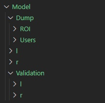

## Palm Vein Identification 

All work writed on **C#** with Jupyter Notebook *(.Net Interactive)*
Used *CASIA Multi-Spectral Palmprint Database*: http://biometrics.idealtest.org/dbDetailForUser.do?id=6

Sample structure of model u can see on this image  

Or open [model_structure_sample](/model_structure_sample/) folder

Sample preprocessing u can see in [jupyter notebook](net-interactive/image-preprocess-sample.ipynb) (.net interactive)  
This method very slowly, ~3h for 7200images  
New ROI extracting method u can see in this [jupyter notebook](net-interactive/roi-new-method.ipynb) (.net interactive), ~2min for 7200images

## Image processing time

Total users: **100**
Total palm collection: **1200**
Elapsed time: **00:02:24.5661141**  

Total users: **100**  
Total palm collection: **7200**  
Elapsed time: **00:14:17.8218831**  

## Packages
	
1. [OpenCvSharp4.Windows](https://github.com/shimat/opencvsharp)
2. [ML.Net](https://github.com/dotnet/machinelearning)
3. [XPlot.Plotly](https://github.com/fslaborg/XPlot)
4. [MoreLinq](https://morelinq.github.io/)
5. [CSVHelper](https://joshclose.github.io/CsvHelper/)
6. [TensorFlow](https://storage.googleapis.com/tensorflow/windows/gpu/tensorflow_gpu-2.1.0-cp37-cp37m-win_amd64.whl)